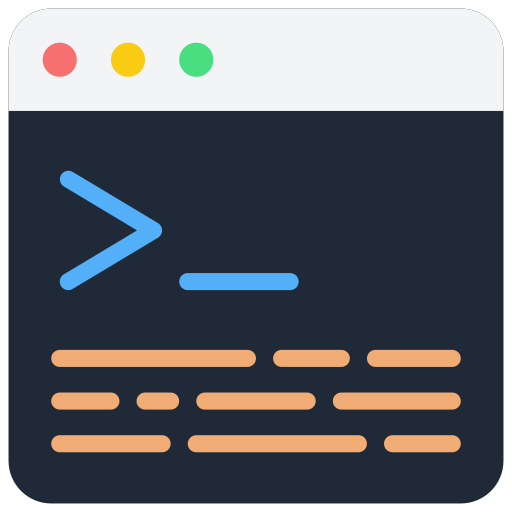

  

<h1 align="center">my-terminal</h1>

Nextjs와 tailwindcss를 사용하여 터미널 형태의 웹페이지를 제작하였습니다.  
미리 정해놓은 명령어로 작동합니다.

## 🔧 Skills or Tools
- Nextjs
- React
- ES2015+
- tailwindcss
- Git
- Vercel

## 🎯 Features
1. Nextjs + Typescript + tailwindcss 조합으로 만들기

2. useRef
   - 어느 곳을 클릭해도 input에 포커스
   - scrollIntoView를 사용하여 명령어 작동시 화면의 하단으로 이동

3. 다양한 명령어 작동
   - 첫 화면에서 배너와 함께 시작
   - 상하 방향키 누를시, 이전에 사용한 명령어 등장

4. 필수 명령어와 그 기능
   - help: 존재하는 모든 명령어 표시
   - clear: 기존의 기록 모두 삭제
   - banner: 첫화면에 나오는 배너 표시
   - restart: 새로고침 하듯, 모든 기록을 삭제하고  처음 실행 화면처럼 표시
   - blog, github, repo 등: winodw.open을 사용하여 외부페이지 연결

## 📌 Thinng to Do
- [ ] Tap 키 누를시 명령어 완성 기능
- [ ] 명령어 추가: 테마 변경

## 💫 Deploy
Vercel로 배포

